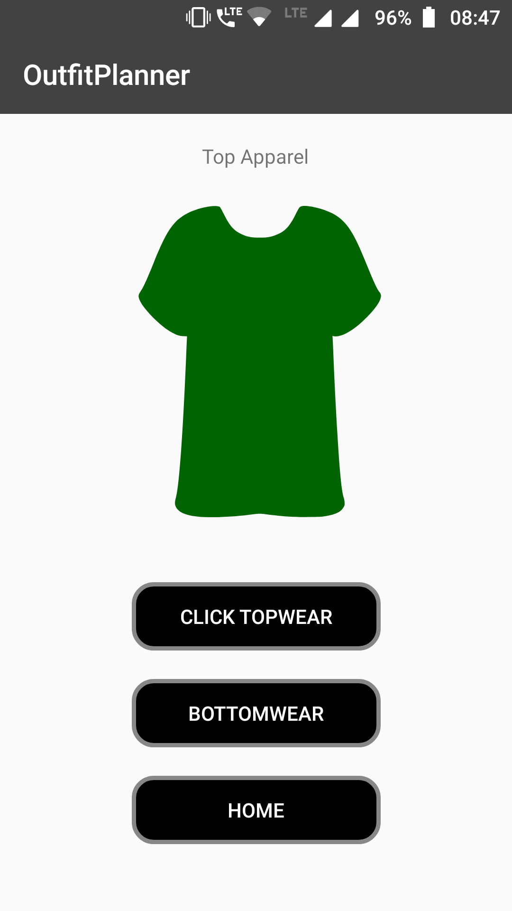
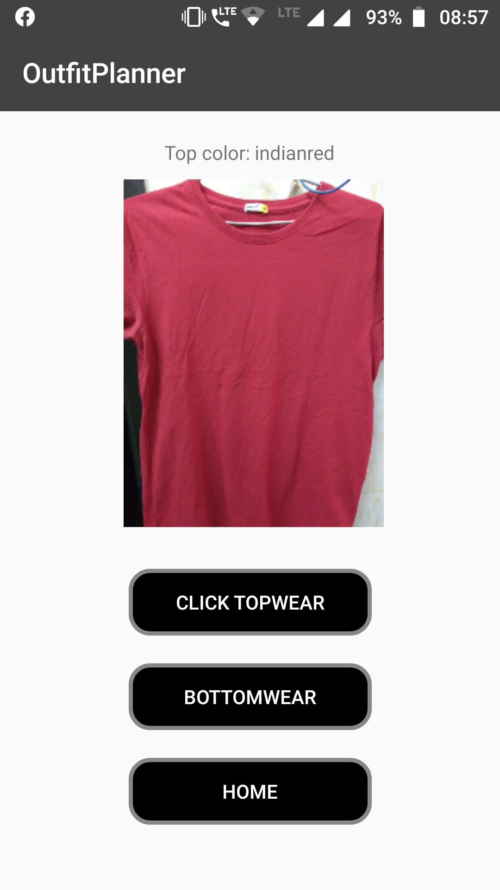
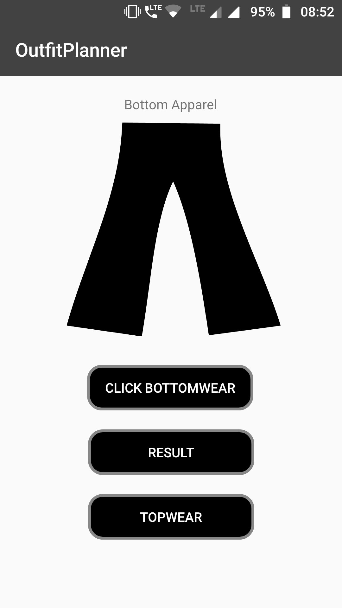
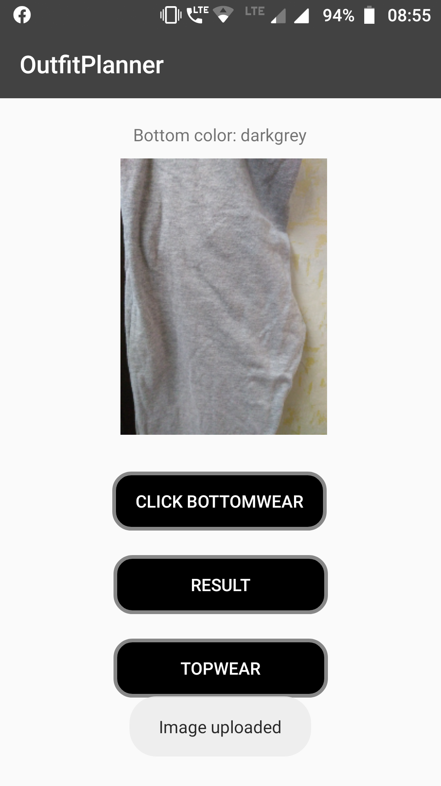
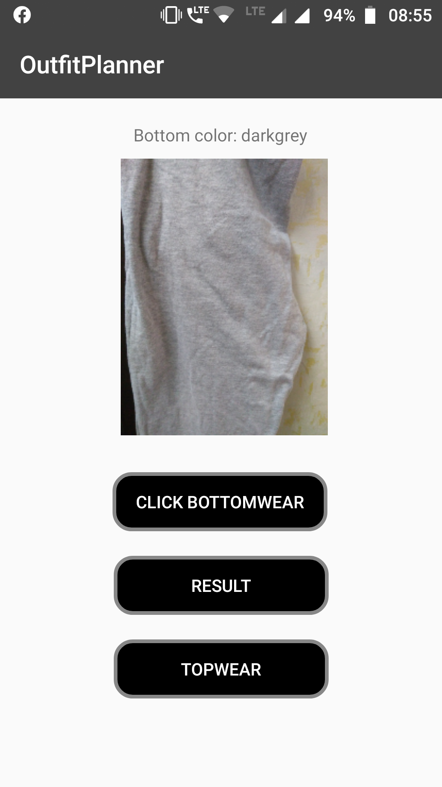
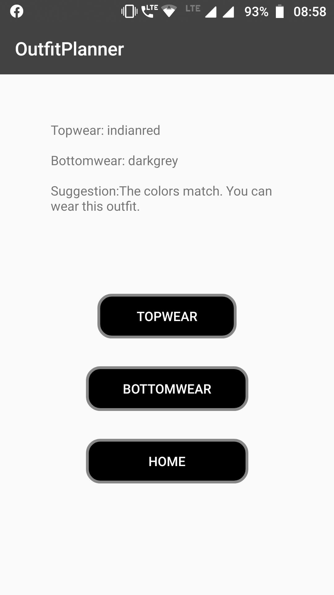

<h1 align='middle'>Outfit Planner</h1>

 Android application to assist blind/colorblind people in choosing their attire

<h3> Outfit Planner </h3>
 

 
 

 
 

#### Contributors:
- [@Aniket Patil](https://github.com/aniketp319)
- [@Greeva Shah](https://github.com/greevashah)
- [@Raj Vora](https://github.com/raj-vora)

##### Download the APK [HERE](https://drive.google.com/open?id=1bYrZuFSWBl0lN1Km4prO9nU1zDwvXTrR)
